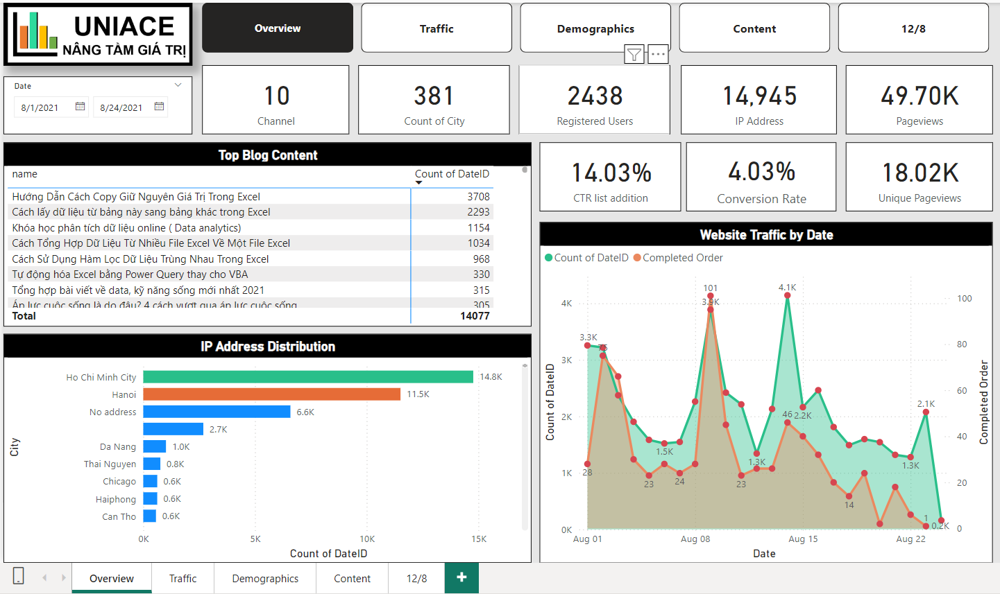
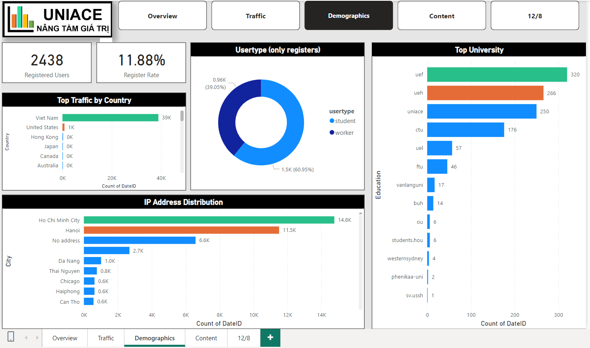
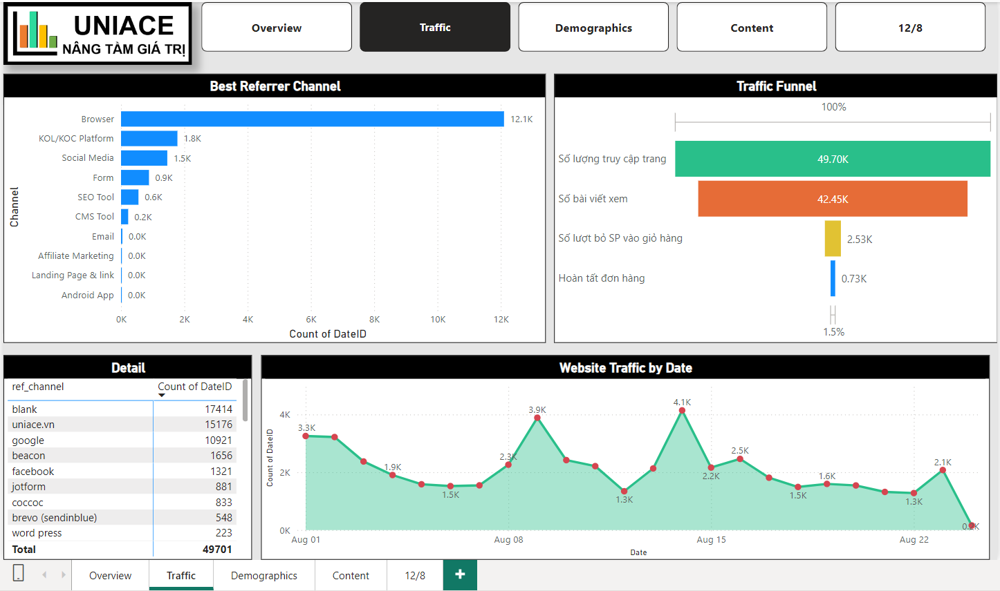
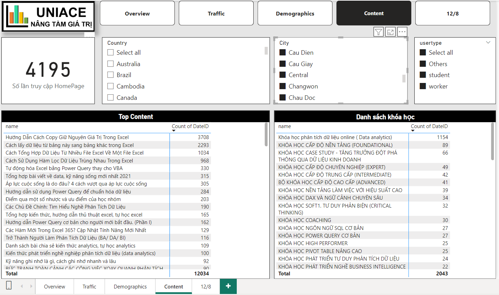
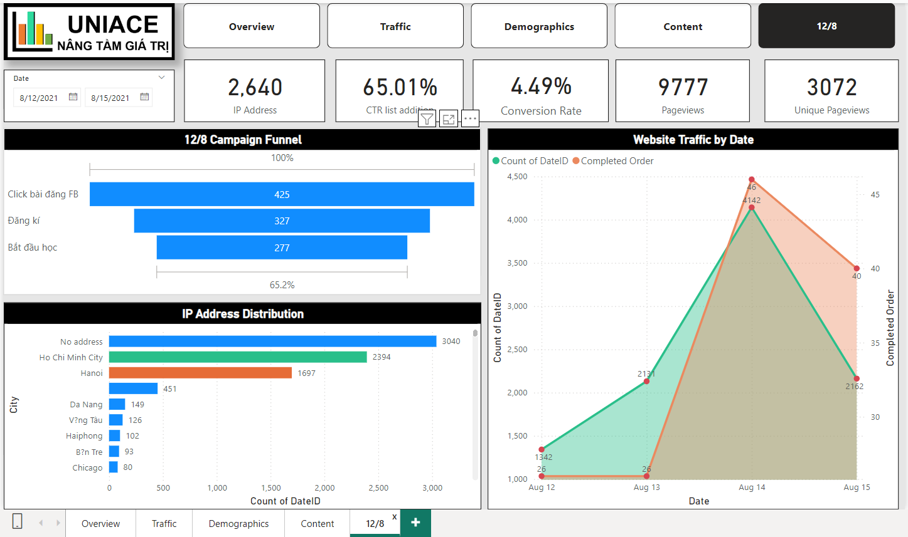

# Uniace Website and Marketing Campaign Analysis

## Project Background
Uniace is an online training platform in Vietnam that specializes in courses on critical thinking and effective data analysis tailored to specific industries. Beyond training, Uniace supports businesses in building management platforms essential for digital transformation. This project focuses on analyzing the website's performance and evaluating the effectiveness of a marketing campaign launched in August 2021.

The analysis includes the following key areas:

- Website traffic and user engagement.
- Demographics and customer segmentation.
- Funnel performance and conversion rates.
- Content performance.
- Marketing campaign effectiveness.

## Data Structure & Initial Checks
The analysis leverages data collected from customer interactions with Uniace's website. The main database consists of the following fields:

| Column Name       | Description                               |
|-------------------|-------------------------------------------|  
| Email             | User’s email address and associated metadata |
| Type              | Type of content interacted with (e.g., page, form) |
| Name              | Specific content title (e.g., blog article) |
| Title             | Additional metadata about the content |
| URL               | Address of the web page |
| Referrer          | The source directing the user to the site |
| Path              | Website navigation path |
| IP Address        | Location-based metadata (country, city) |
| Date              | Timestamp of user interaction |

## Executive Summary
### Key Insights
1. **Website Performance**: The website received traffic from 14,945 unique IPs across 38 countries, with a conversion rate of 4.03%.
- Most traffic originated from Ho Chi Minh City and Hanoi.
- Conversion Rate is 4,03% with Completed Order is target value. Besides, customers had 14,03% add products to cart.
- The best traffic in August was day 14 but the item sold was not as good as on day 9

2. **Demographics**: 60.95% of registered users are students, predominantly from economic universities. The U.S. market shows significant activity, particularly in Chicago.
- With 2438 users logged in by email while using website. We had the registation rate for all is 11,88%.
- For registers, they were extracted into 2 types based on their email: 60,95% student and 39,05% worker
- Students from 5 universities such as UEF, UEH, CTU, UEL and FTU have more accounts

3. **Funnel Analysis**: A major drop-off occurs between website views and add-to-cart actions. Only 5.95% of users add products to the cart after viewing.
- The number of customers clicked to add products to the cart was 2527 and just 726 orders were finished successfully (28,73% percent of previous step).
- Our customers dropped so much when they viewed our website and did not add products to cart ( only 5.95%)
- The traffic recorded by Browser was the best.
- The traffic on August 9th increased dramatically from the KOL/KOC platform channel

4. **Content Performance**: Excel-related articles and data analytics courses are the most popular, while soft skills and cultural articles see limited interest.
- Top 5 content that is interested and read a lot are articles related to mircosoft excel.  
- The 3 most popular courses are the data analytics online course, the foundation course, and the casestudy course. 
- In general, courses related to language, soft skills and thinking have low levels of desire and access. The same goes for articles about culture, life skills, and headlines. 
- Students like articles about skills, interviews, knowledge and self-study guides.

5. **Marketing Campaigns**: The 12/8 Facebook campaign successfully boosted traffic and enrollment, though the earlier KOL/KOC campaign on 8/8 outperformed in order volume.
- The campaign brought 112 orders within 3 days 13th, 14th, 15th. Similar to the trend of traffic.
- The rate of placing an order in the cart is up to 65.01%, but the successful conversion rate is still maintained at 4.49%
- However, the campaign was not as effective as the campaign using the KOL/KOC platform on 8/8 when the number of orders was higher (101 on 9/8 vs 46 on 14/8).

## Insights Deep Dive
### Traffic Analysis
- Most traffic originated from Ho Chi Minh City and Hanoi.
- KOL/KOC campaigns yielded the highest traffic spikes and conversions.
- Browser was the primary source of traffic.

### Funnel Performance
- Add-to-cart conversion rates were significantly low.
- Recommendations:
  - Improve blog content quality.
  - Optimize the “Add to Cart” user interface.

### Content Analysis
- Excel-related blogs drove the most engagement.
- Industry-specific courses were highly popular among working professionals.
- Students preferred skill-building and self-study content.

### Campaign Effectiveness
- The 12/8 campaign increased traffic by targeting Facebook groups, achieving a 65.01% add-to-cart rate.
- Despite higher traffic, the campaign’s conversion rates were lower compared to the 8/8 KOL/KOC-driven efforts.

## Recommendations
### Website Optimization
1. Enhance blog content to align with user interests.
2. Redesign the “Add to Cart” process to improve usability.
3. Develop holistic courses combining multiple skills.

### Marketing Strategies
1. Focus on economic universities in Vietnam and target Chicago for U.S. campaigns.
2. Leverage data-driven insights to refine ad targeting and content relevance.
3. Continue collaborations with KOLs/KOCs for impactful campaigns.

## Assumptions and Caveats
- Some data fields contained missing or inaccurate information, which was addressed through data cleaning and imputation.
- Regional segmentation assumes consistent behavior across similar demographics.
- Conversion rates depend heavily on external factors such as economic conditions and competitor activities.

---

This project serves as a comprehensive analysis of Uniace’s digital presence and provides actionable insights to improve future strategies.

